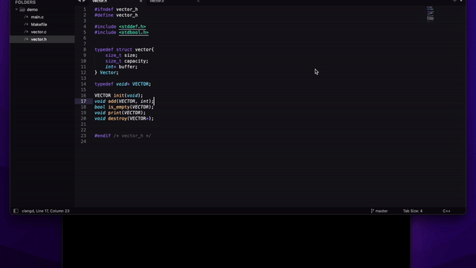

# 🚀 AutoCommit: Your AI-Powered Commit Message Generator

<div align="center">

[](https://www.oracle.com/java/technologies/javase-jdk11-downloads.html)
[](https://opensource.org/licenses/MIT)
[](https://github.com/Ibrahim-Haroon/git-autocommit-cli/actions/workflows/build.yaml)
[](https://github.com/Ibrahim-Haroon/git-autocommit-cli/releases)

</div>
<div align="center">
  <strong>AutoCommit is a powerful CLI tool that leverages AI to generate meaningful commit and PR messages to save you time!</strong>
</div>
<br>
<div align="center">
  <a href="#-installation">Installation</a> •
  <a href="#-features">Features</a> •
  <a href="#️-usage">Usage</a> •
  <a href="#-contributing">Contributing</a>
</div>
<br>
<div align="center">
  
</div>
---

## 🌟 Features

- 🤖 Generate commit messages using local LLM or OpenAI models
- 💻 Easy-to-use CLI interface
- 🎨 Customizable default settings
- 🐳 Docker support for local LLM model

---

## 📦 Installation

<details>
<summary>Click to expand installation steps</summary>

1. Clone the repository
   ```shell
   git clone -b install https://github.com/Ibrahim-Haroon/git-autocommit-cli.git
   ```

2. Run the install script
   - For Unix-based systems:
     ```shell
     ./install.sh   # prefix with sudo for mac
     ```
   - For Windows:
     ```shell
     ./windows_install.ps1
     ```

3. Source the configuration file based on your shell:
   <details>
   <summary>For bash</summary>

   ```shell
   source ~/.bashrc
   ```
   </details>
   <details>
   <summary>For zsh</summary>

   ```shell
   source ~/.zshrc
   ```
   </details>

4. Export the path to the JAR file:
   - Find the location of the `autocommit` executable:
     ```shell
     which autocommit
     ```
   - Append the export path to your shell configuration file:
     ```shell
     echo 'export PATH=$PATH:/path/to/autocommit' >> ~/.zshrc   # or ~/.bashrc for bash users
     ```

5. Verify installation
   ```shell
   autocommit --test
   ```

</details>

---

## 🛠️ Usage

### Generate a commit message

<table>
<tr>
<th>Local LLM model</th>
<th>OpenAI model</th>
<th>Anthropic model</th>
<th>Google Vertex AI model</th>
</tr>
<tr>
<td>

```shell
autocommit --local
```

</td>
<td>

```shell
autocommit --openai
```

Requires OpenAI API key:
```shell
autocommit --set-openai-key <api-key>
```
[Get API key here](https://platform.openai.com/api-keys)

</td>
<td>

```shell
autocommit --anthropic
```

Requires Anthropic API key:
```shell
autocommit --set-anthropic-key <api-key>
```
[Get API key here](https://console.anthropic.com/settings/keys)

</td>
<td>

Set Project Id and Location:
```shell
autocommit --set-google-vertex-project-id YOUR_PROJECT_ID
autocommit --set-google-vertex-location YOUR_LOCATION
```

Then run:
```shell
autocommit --google
```

</td>
</tr>
</table>

### Set default settings
```shell
autocommit --set-default <google/local/openai/anthropic>
```

### See all available commands
```shell
autocommit --help
```

<details>
<summary>Click to see all options</summary>

```
Options: 
    --set-default, -d -> Set the default LLM response service { Value should be one of [local, openai, google, anthropic] }
    --set-openai-key -> Set OpenAI API key { String }
    --set-anthropic-key -> Set the anthropic API key { String }
    --set-google-vertex-project-id, -vertex-project-id -> Set the Google vertex project ID { String }
    --set-google-vertex-location, -vertex-location -> Set the Google vertex location { String }
    --local, -l [false] -> Use Local LLM response service
    --openai, -o [false] -> Use OpenAI LLM response service
    --anthropic, -a [false] -> Use Anthropic LLM response service
    --google, -g [false] -> Use Google LLM response service
    --make-pr-summary, -pr [false] -> Create a summary based off git log for PR message
    --plain-pr, -plain-pr [false] -> Create a summary based off git log for PR message without GUI
    --test, -t [false] -> Test CLI tool was installed correctly
    --version, -v [false] -> Show the version of the tool
    --help, -h -> Usage info
```

</details>

---

## 🖥️ Local LLM Setup

1. Download the model from [Hugging Face](https://huggingface.co/TheBloke/Llama-2-13B-chat-GGUF/blob/main/llama-2-13b-chat.Q4_K_M.gguf)
2. Place it in the `localLLM` directory
3. Run the model

---

## 🤝 Contributing

We welcome contributions to this project! Here's how you can help:

1. 📢 Create an issue ticket
2. 🍴 Fork the repository
3. 🛠️ Make your changes
4. 🎉 Submit a pull request

> Please ensure your code has kdocs and intuitive naming conventions.

---
